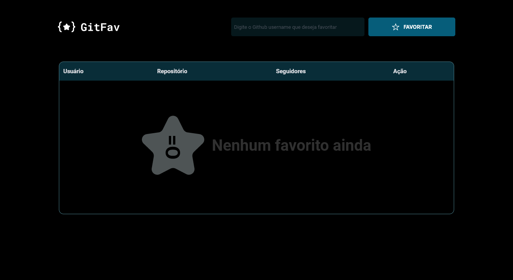
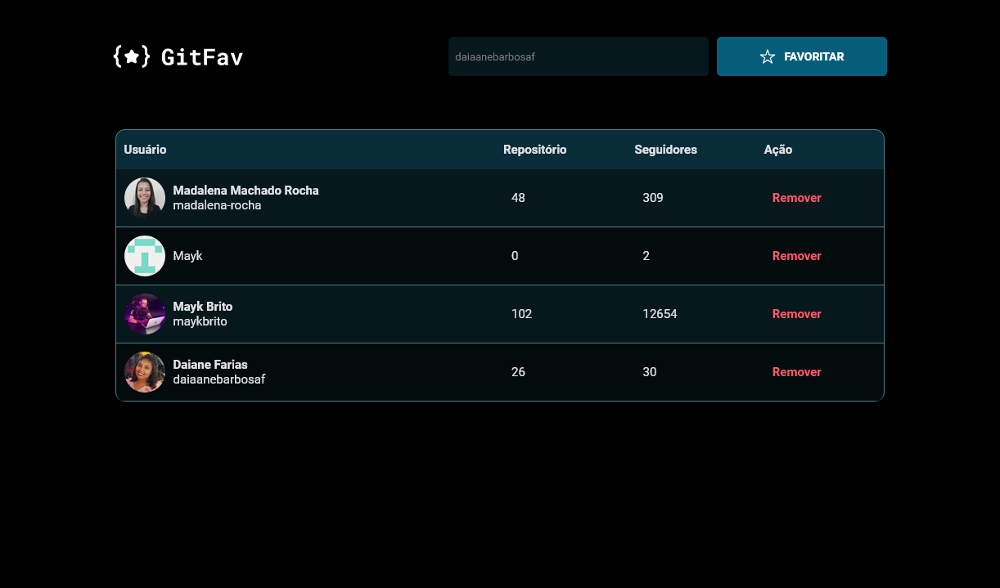
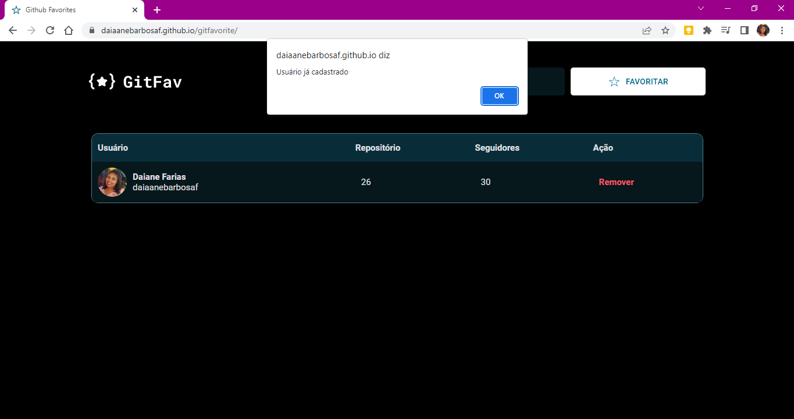
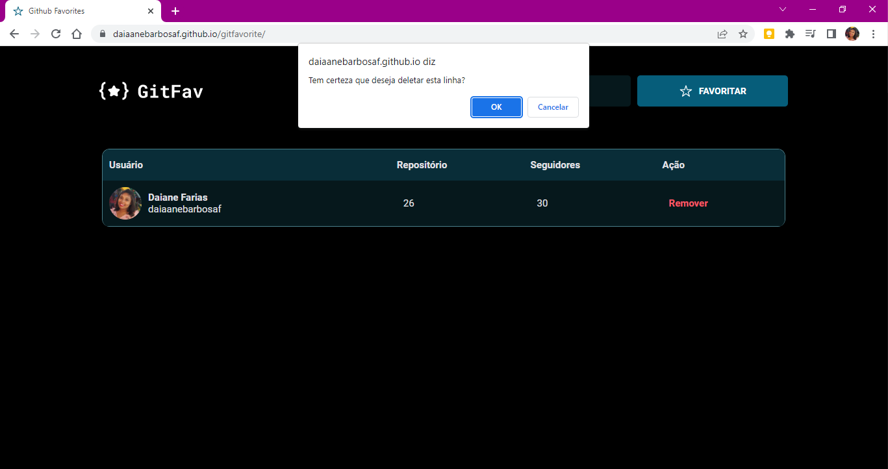

<h1 align="center">⭐ Git Favorite ⭐</h1>

  <a href="#-tecnologias">Tecnologias</a>&nbsp;&nbsp;&nbsp;|&nbsp;&nbsp;&nbsp;
  <a href="#-projeto">Projeto</a>&nbsp;&nbsp;&nbsp;|&nbsp;&nbsp;&nbsp;
  <a href="#-layout">Layout</a>&nbsp;&nbsp;&nbsp;|&nbsp;&nbsp;&nbsp;
  <a href="#memo-licença">Licença</a>

  

É um apicativo de busca de perfils usando a API do GitHub, a ideia é você favoritar os usuário que mais gosta de acessar, é possível remover e colocar outros.

 

## 🚀 Tecnologias

Esse projeto foi desenvolvido com as seguintes tecnologias:

&nbsp;
&nbsp;
&nbsp;

## 💻 Projeto

- Consumo de API;
- Orientação a objetos;
- Manipulação da DOM;
- Conceitos da POO;
- Herança;
- Polimorfismo;
- Imutabilidade;
- Método filter();
- localStorage;
- Async Await;
- Try, catch e trow.

## 🔖 Layout

## Venha ver como ficou e teste as funcionalidades:

https://daiaanebarbosaf.github.io/gitfavorite/

---